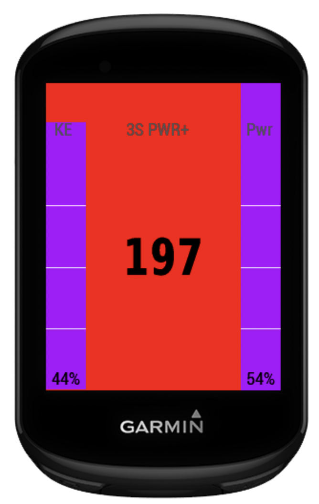
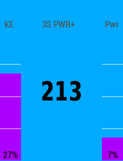

Helps riders using a power meter improve time trial performance by
showing real-time power variability. The key idea is smaller power and
energy fluctuations result in faster times and lower fatigue.

The **Power Stability Field** supports "steady-state\" effort by
providing visual feedback on how smooth and consistent your power and
kinetic energy are in real-time. Here is how a cyclist experiences the
data field during a ride:
{width="1.7083333333333333in"
height="2.236111111111111in"}!

### 1. The Core Metric: 3-Second Power

At the center of the display, you see your standard **3-second average
power**. This provides the immediate feedback on current effort.

### 2. The Dynamic Background: Effort Trending

The background color acts as a \"trend indicator.\" By comparing
3**-second power** to your **10-second power**, the field changes color
to tell you if your effort is currently surging or fading.

Background shifts, indicate the absolute Percent Difference, **% Diff,**
between the rolling 3s and 10s mean average powers. Blue indicates the
lowest difference (e.g., below 10%), red exceeds max value, (e.g., 20%),
green in-between. Under a lower power limit, 100 Watts, the display is
plain. Limits are configurable.

### 3. Stability Gauges: The "Purple Bars"

{width="1.7083333333333333in"
height="2.236111111111111in"}!

Visualize **Stability % (Coefficient of Variation)**, purple bars grow
or shrink based on two metrics:

- **Left: Kinetic Energy (KE)** stability: This is useful for time
  trialists or solo riders; it measure how KE is changing, (delta
  Velocity Squared). Rate of KE change is a component of power
  consumption, or addition, i.e., adds power.

- **Right: Power Stability (Pwr):** Shows how consistent your power
  output is over a rolling 10-second window. A smaller bar indicates a
  steady output style, while a larger bar suggests an erratic effort
  with frequent micro-surges.

### 4. Post-Ride Analysis

The data field records both the **Power Stability (CV_Pwr)** and **KE
Stability (CV_KE)** directly into your activity's 

FIT file.{width="4.638888888888889in"
height="7.333333333333333in"}!

### Summary for the Athlete

Instead of just asking *"How hard am I pushing?"*, this field
answers *\"How steady is my effort?\"*. It's a tool designed to improve
their efficiency and maintain a smooth flow.

(https://velo.outsideonline.com/road/road-training/how-to-ride-the-perfect-time-trial-constant-power-vs-variable-power/)
